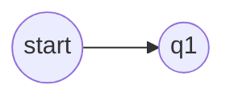

# 计算理论大作业：AI 题目解析与求解

本项目用于自动化完成计算理论课程大作业中的两项核心工作：

1. **Step 1：题目解析**
   - 读取题目截图
   - 调用 Qwen 多模态模型识别题干
   - 将数学公式转换为 LaTeX
   - 将题图转换为 Mermaid 代码
   - 汇总为 Markdown 文件

2. **Step 2：题目求解**
   - 读取 Step 1 生成的题干与 Mermaid
   - 调用 DeepSeek 模型生成详细解答
   - 统一将公式格式规范为 Markdown 兼容 LaTeX
   - 输出逐题解答与总汇总文件

---

## 项目结构

```text
D:\study\研一下\计算理论大作业\
├── .env                         # 本地环境变量（不提交）
├── .env.example                 # 环境变量模板
├── .gitignore
├── pyproject.toml               # uv 项目配置
├── README.md
├── scripts/
│   ├── run_step1.py             # Step 1 入口
│   └── run_step2.py             # Step 2 入口
├── src/
│   └── ct_solver/
│       ├── __init__.py
│       ├── prompts.py           # Qwen / DeepSeek 提示词
│       ├── scanner.py           # 题目目录扫描
│       ├── step1_parse.py       # Step 1 解析逻辑
│       └── step2_solve.py       # Step 2 解题逻辑（支持并发）
├── output/                      # Step 1 输出（不提交）
│   ├── parsed/
│   └── all_problems.md
├── solutions/                   # Step 2 输出（不提交）
│   ├── per_problem/
│   └── all_solutions.md
└── 计算理论课后题/              # 题目图片目录（不提交）
```

---

## 环境要求

- Python **3.10+**
- [uv](https://docs.astral.sh/uv/)
- 可用的 Qwen 多模态接口
- 可用的 DeepSeek API

---

## 安装依赖

在项目根目录执行：

```bash
uv sync
```

---

## 环境变量配置

复制模板文件：

```bash
cp .env.example .env
```

然后按你的实际环境填写：

```env
# Qwen API
QWEN_BASE_URL=http://127.0.0.1:8317
QWEN_API_KEY=your-qwen-api-key
QWEN_MODEL=coder-model

# DeepSeek API
DEEPSEEK_BASE_URL=https://api.deepseek.com
DEEPSEEK_API_KEY=your-deepseek-api-key
DEEPSEEK_MODEL=deepseek-chat

# 输入/输出目录
PROBLEM_IMAGE_DIR=计算理论课后题
OUTPUT_DIR=output
SOLUTIONS_DIR=solutions

# 单题超时（秒）
STEP_TIMEOUT_SECONDS=300

# Step 2 并发数
STEP2_CONCURRENCY=6
```

说明：
- `STEP_TIMEOUT_SECONDS=300` 表示单题最多运行 5 分钟
- `STEP2_CONCURRENCY=6` 表示 Step 2 默认最多并发 6 道题

---

## 输入数据约定

题目图片目录结构如下：

```text
计算理论课后题/
├── 第0章/
│   ├── 0.4/
│   │   └── 题干.png
│   ├── 0.9/
│   │   ├── 题干.png
│   │   └── 题图.png
├── 第1章/
│   └── 1.15/
│       ├── 题干.png
│       └── 题图.png
```

约定：
- `题干*.png/jpg/jpeg`：题目正文截图
- `题图*.png/jpg/jpeg`：题目附图

程序会自动扫描章节与题号，无需手工登记。

---

## Step 1：解析题目

### 全量运行

```bash
uv run python scripts/run_step1.py
```

### 只运行指定章节

```bash
uv run python scripts/run_step1.py --chapter 0
uv run python scripts/run_step1.py --chapter 9,10
```

### 输出内容

- `output/parsed/第X章/X.Y.md`：逐题解析结果
- `output/all_problems.md`：全部题目汇总
- `output/unfinished_step1.md`：未完成题目清单（若存在）

### 特性

- 支持断点续传：已生成的题目会自动跳过
- 对含题图题目进行 Mermaid 规范化
- 单题超时自动跳过并记录

---

## Step 2：生成解答

### 全量运行

```bash
uv run python scripts/run_step2.py
```

### 只运行指定章节

```bash
uv run python scripts/run_step2.py --chapter 0
uv run python scripts/run_step2.py --chapter 9,10
```

### 输出内容

- `solutions/per_problem/第X章/X.Y.md`：逐题解答
- `solutions/all_solutions.md`：全部解答汇总
- `solutions/unfinished_step2.md`：未完成题目清单（若存在）

### 特性

- 支持并发解题
- 支持断点续传
- 自动将 `\(...\)` / `\[...\]` 转换为 `$...$` / `$$...$$`
- 单题超时自动跳过并记录

---

## 输出格式示例

### Step 1 输出示例

```md
### 题干
1.15 给出一个反例，说明下述构造不能证明定理 1.24 ...

### 题图 Mermaid

```

### Step 2 输出示例

```md
# 题目 1.15

## 原题题干
[解析出的题干]

## 题图 Mermaid
```mermaid
...
```

## 解题结果
1. **题目分析**
2. **解题思路**
3. **最终答案**
4. **验证**
```

---

## 常见用法

### 1. 新增题目后只补跑新增解析

如果你往 `计算理论课后题/` 中继续新增题目，只需再次执行：

```bash
uv run python scripts/run_step1.py
```

程序会自动跳过已有解析结果，只处理新增题目。

### 2. 想重跑某一章

先删除对应输出目录中的目标文件，再执行：

```bash
uv run python scripts/run_step1.py --chapter 7
uv run python scripts/run_step2.py --chapter 7
```

### 3. 想提高 Step 2 速度

可以调高：

```env
STEP2_CONCURRENCY=8
```

但不建议设得过高，避免 API 限流或本地资源占用过大。

---

## Git 说明

以下内容默认不会提交到 git：

- `.env`
- `output/`
- `solutions/`
- `计算理论课后题/`

这样可以避免把：
- API 密钥
- 题目原图
- 大量生成结果

提交到仓库中。

---

## 当前项目能力总结

本项目当前支持：

- 自动扫描题目目录
- 多模态识别题干与题图
- 将公式转为 LaTeX
- 将题图转为 Mermaid
- 按章节和题号生成解析结果
- 并发调用 DeepSeek 全量解题
- 超时保护与未完成题目清单
- 总汇总 Markdown 输出

---

## 后续可继续改进的方向

- 增加 Mermaid 渲染校验
- 增加更精细的日志输出
- 增加 Step 1 并发解析
- 增加失败题自动重试机制
- 增加 HTML/PDF 导出
